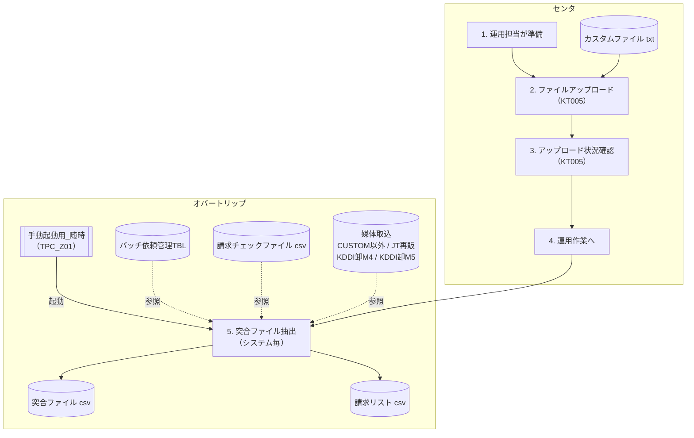

# 詳細業務フロー（突合ファイル抽出（随時）） - 突合ファイル抽出

> ※このシートは図形で構成されているため、LM Studio(google/gemma-4-31b-qat)が図形シートのPNG画像から内容を再構成したものです。

# 突合ファイル抽出(随時)
## 概要
カスタムファイルと請求チェックファイルから、突合ファイルと請求リストを出力する。

## 業務フロー
1.運用担当が準備(センタ) -> 2.ファイル アップロード(センタ)
2.ファイル アップロード(センタ)は KT005 を使用し、カスタムファイル txt をアップロードする
2.ファイル アップロード(センタ) -> 3.アップロード 状況確認(センタ)
3.アップロード 状況確認(センタ)は KT005 を使用する
3.アップロード 状況確認(センタ) -> 4.運用作業へ(センタ)
4.運用作業へ(センタ) -> 5.突合ファイル抽出（システム毎）(オバートリップ)
5.突合ファイル抽出（システム毎）(オバートリップ)は 手動起動用_随時（TPC_Z01）により起動する
5.突合ファイル抽出（システム毎）(オバートリップ)は バッチ依頼管理TBL、請求チェックファイル csv、および媒体取込（CUSTOM以外/JT再販/KDDI卸M4/KDDI卸M5）を参照する
5.突合ファイル抽出（システム毎）(オバートリップ)は 突合ファイル csv および 請求リスト csv を出力する

## Mermaid図

