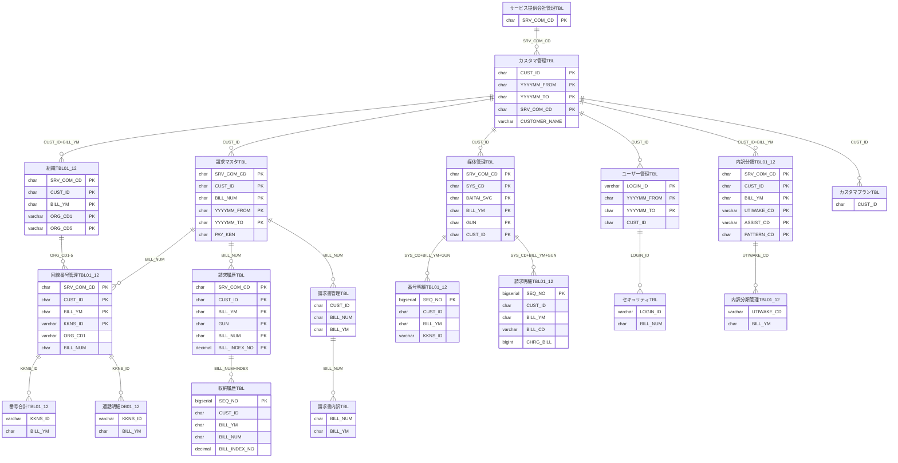
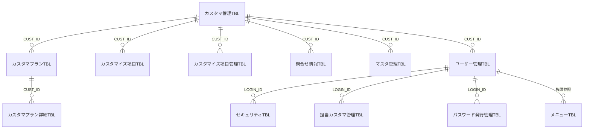
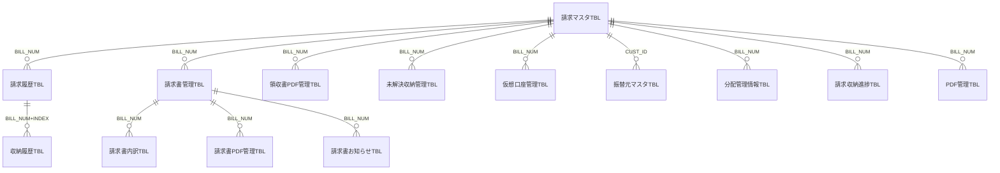
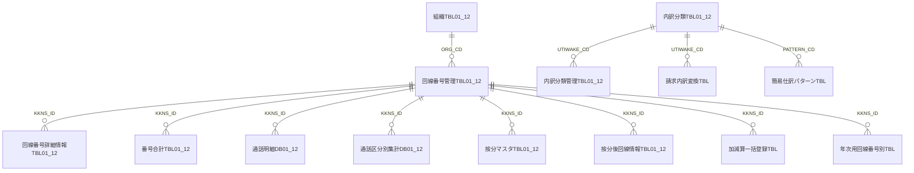
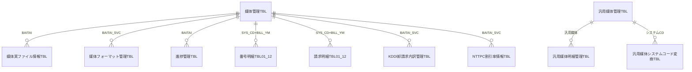

# ER図：データベース仕様（オバートリップ）
LLMを使って50_データベース仕様からER図を作成

元資料: `replaceMd/02_ED書/50_データベース仕様`

## 前提

- テーブル定義書に FK 制約の記載がないため、リレーションは同名キー項目（`SRV_COM_CD` / `CUST_ID` / `BILL_YM` / `BILL_NUM` / `KKNS_ID` / `ORG_CD*` / `LOGIN_ID` / `UTIWAKE_CD` / `BAITAI_SVC` 等）の一致から推定した。
- `～TBL01`〜`～TBL12` は請求月ごとの12か月ローテーション物理テーブル群を1エンティティとしてまとめている。
- `～TMPTBL` / `～WK` は処理用一時テーブル、`～タンキングTBL` は本体の更新前退避テーブルで、いずれも本体と同一キー構成。
- 検索用VIEWは実体を持たないため、別セクションに一覧する。

## 1. コアER図

## 2. サブジェクトエリア別ER図

### 2.1 カスタマ・ユーザー・権限

### 2.2 請求・収納・帳票

### 2.3 組織・回線・明細

### 2.4 媒体取込

## 3. 実テーブル一覧

| # | 論理名 | 物理名 | 区分 | PK（推定） | 概要 |
| --- | --- | --- | --- | --- | --- |
| 1 | AU請求内訳管理TBL | TU109_TB_AU_UTIWAKE | 本体 | SRV_COM_CD, SYS_CD, EKIM_CD, TB_FLG, UTIWAKE_NM, UTIWAKE_CD | AUフォーマット変換用TBL |
| 2 | FAQTBL | FAQTBL | 本体 | SRV_COM_CD, FAQ_NO | FAQの管理TBLカンリ |
| 3 | IPVPN請求内訳管理TBL | TU112_TB_IPVPN_UTIWAKE | 本体 | SRV_COM_CD, SYS_CD, EKIM_CD, USEDCO_COM_CD, TB_FLG, UTIWAKE_NM, TAX_NM | IPVPNフォーマット変換用TBL |
| 4 | JT請求内訳分類TBL | TU113_TB_JT_UTIWAKE | 本体 | SRV_COM_CD, SYS_CD, BAITAI_SVC, BILL_CD | JT用請求内訳を分類するTBL |
| 5 | KDDI卸(メタル・光)請求内訳管理TBL | TU116_TB_PCKDDI_M_H_UTIWAKE | 本体 | SRV_COM_CD, SYS_CD, BAITAI_SVC, ITEM_CD, BILL_CD | KDDI(卸)メタル/光の内訳情報を管理するTBLオロシ |
| 6 | KDDI卸割引区分判定TBL | TU118_TB_PCKDDI_WARI | 本体 | SRV_COM_CD, SYS_CD, BAITAI_SVC, TUU_TYPE, SND_KBN, TUU_KBN, WARI_SVC, WARI_KBN | KDDI(卸)の割引区分を管理するテーブル |
| 7 | KDDI卸請求内訳管理TBL | TU115_TB_PCKDDI_UTIWAKE | 本体 | SRV_COM_CD, SYS_CD, BAITAI_SVC, TUU_KBN | KDDI(卸)の内訳情報を管理するテーブル |
| 8 | NTTPC割引率情報(VPネット用)TBL | TD145_DB_ABCPC_VP_WARIRATE | 本体 | SRV_COM_CD, SYS_CD, BAITAI_SVC, BILL_YM, CUST_ID, DISC_CD, WARI_KBN | 回線管理システムとの連携を管理するTBL |
| 9 | NTTPC割引率情報TBL | TD141_DB_ABCPC_WARIRATE | 本体 | SRV_COM_CD, SYS_CD, BAITAI_SVC, BILL_YM, CUST_ID, WARI_KBN | 回線管理システムとの連携を管理するTBL |
| 10 | PDF管理TBL | TSEX03_PDFMGR | 本体 | REPORT_ID | PDF帳票作成管理ためのワークテーブル |
| 11 | SmaB受付番号管理TBL | TSEX01_SMABNUMMGR | 本体 | VARCHAR | Smart Billingとの連携時に受付番号でファイル送受信を管理するため、その番号を管理するためのテーブルレンケイジウケツケバンゴウソウジュシンカンリバンゴウカンリ |
| 12 | SmaB受付番号管理明細TBL | TSEX02_SMABNUMDTL | 本体 | VARCHAR | Smart Billingとの連携時に受付番号でファイル送受信を管理するため、その番号を管理するためのテーブルレンケイジウケツケバンゴウソウジュシンカンリバンゴウカンリ |
| 13 | アップロードダウンロード管理TBL | TU159_TB_UPDOWNMANAGE | 本体 | SRV_COM_CD, FILE_TYPE, UD_KBN, TRAN_FROM, TRAN_TO | 複数機能から呼び出されるアップロード・ダウンロード機能を管理する。フクスウキノウヨダキノウカンリ |
| 14 | カスタマイズドダウンロードデータ一時データTBL | TU163_DB_DLDATA_T | 一時/WK | REQUEST_ACCEPT_NO, SEQ | 一括ダウンロード_カスタマイズドデータで作成するダウンロードファイルの情報をレコード単位で一時登録するサクセイジョウホウタンイイチジトウロク |
| 15 | カスタマイズ項目TBL | TU079_DB_DLITEM | 本体 | SRV_COM_CD, CUST_ID, PTN_CD, DSP_SEQ | カスタマ単位にカスタマイズされた項目情報を管理するテーブルタンイコウモクジョウホウカンリ |
| 16 | カスタマイズ項目ﾏｽﾀTBL | TU008_TB_DLITEMMST | 本体 | SRV_COM_CD, DSP_SEQ | 一括請求内訳ＣＳＶの項目情報を管理するTBL |
| 17 | カスタマイズ項目管理TBL | TU080_DB_DLMNG | 本体 | SRV_COM_CD, CUST_ID, PTN_CD | カスタマ単位にカスタマイズの パターン数と共通情報を管理するテーブル |
| 18 | カスタマプランTBL | TU012_DB_CUSTPLAN | 本体 | SRV_COM_CD, CUST_ID, YYYYMM_FROM, YYYYMM_TO | カスタマ毎にプラン（詳細は別）の照会、保存期間の管理を行うテーブルゴトショウサイベツショウカイホゾンキカンカンリオコナ |
| 19 | カスタマプランタンキングTBL | TU126_DB_CUSTPLAN_TKG | タンキング | SRV_COM_CD, REQUEST_ACCEPT_NO, LINE_NO, CUST_ID, YYYYMM_FROM, YYYYMM_TO | カスタマ毎にプラン（詳細は別）の照会、保存期間の一時的に管理を行うテーブルゴトショウサイベツショウカイホゾンキカンカンリオコナ |
| 20 | カスタマプラン詳細TBL | TU013_DB_PLANDTL | 本体 | SRV_COM_CD, CUST_ID, YYYYMM_FROM, YYYYMM_TO, PLAN_CD | カスタマ単位契約プランの詳細を管理するテーブル |
| 21 | カスタマプラン詳細タンキングTBL | TU128_DB_PLANDTL_TKG | タンキング | SRV_COM_CD, REQUEST_ACCEPT_NO, LINE_NO, CUST_ID, YYYYMM_FROM, YYYYMM_TO, PLAN_CD | カスタマ単位契約プランの詳細を一時的に管理するテーブル |
| 22 | カスタマ管理TBL | TU009_DB_CUSTOMER | 本体 | CUST_ID, YYYYMM_FROM, YYYYMM_TO, SRV_COM_CD | ユーザ基本情報を管理するテーブル |
| 23 | カスタマ管理タンキングTBL | TU124_DB_CUSTOMER_TKG | タンキング | REQUEST_ACCEPT_NO, LINE_NO, CUST_ID, YYYYMM_FROM, YYYYMM_TO, SRV_COM_CD | ユーザ基本情報を一時的に管理するテーブルイチジテキ |
| 24 | カスタマ数管理TBL | TU007_DB_CUSTNO | 本体 | SRV_COM_CD | 登録カスタマ数を管理するテーブル |
| 25 | ご利用会社共通化TBL | TS008_TB_UCOCNV | 本体 | SRV_COM_CD, SYS_CD, USEDCO_INFO | 各キャリアで異なるコード値／和名を共通的に扱うコードに変換するために使用するテーブル |
| 26 | ご利用会社和名変換TBL | TS009_TB_UCOCOM | 本体 | SRV_COM_CD, USEDCO_COM_CD | 集計時の名称表示に使用するテーブル |
| 27 | サービス提供会社管理TBL | TS001_TB_INFORMER | 本体 | SRV_COM_CD, YYYYMM_FROM, YYYYMM_TO | 合算請求の提供会社を管理するテーブル |
| 28 | スケジュールTBL | TU039_DB_SCHEDULE | 本体 | SRV_COM_CD, CUST_ID, BILL_YM, GUN, DATE_DSP, DPS_NO, MSG_CD, LINK_URL | カスタマ単位で運用スケジュール・お知らせを管理 |
| 29 | セキュリティTBL | TU020_DB_SECURITY | 本体 | SRV_COM_CD, LOGIN_ID, YYYYMM_FROM, YYYYMM_TO | 利用者（ログインユーザー）の権限情報を管理するテーブル |
| 30 | セキュリティタンキングTBL | TU153_DB_SECURITY_TKG | タンキング | SRV_COM_CD, REQUEST_ACCEPT_NO, LINE_NO, LOGIN_ID, YYYYMM_FROM, YYYYMM_TO | 利用者（ログインユーザー）の権限情報を一時的に管理するテーブルイチジテキ |
| 31 | データ更新管理TBL | TU024_DB_DATAMNG | 本体 | SRV_COM_CD, CUST_ID | カスタマ単位でマスタＤＢの状況を管理（排他制御）するテーブル |
| 32 | テーブル一覧 |  | 本体 | - |  |
| 33 | パスワード発行管理TBL | TS034_PWDCTL | 本体 | SRV_COM_CD, LOGIN_ID | ログインユーザのパスワード発行状況TBLハッコウジョウキョウ |
| 34 | バッチ依頼管理TBL | TD147_TB_BATCH_IRAI | 本体 | REQUEST_ACCEPT_NO | バッチ処理実行依頼の受付結果およびバッチ処理の実行結果を管理 |
| 35 | バッチ起動順マスタTBL | TU156_TB_BATCH_ORDER | 本体 | SRV_COM_CD, PROCESS_ORDER | バッチ処理の起動順を一覧化したマスタキドウジュンイチランカ |
| 36 | マスタアップロード登録TBL | TS028_DB_MASTUP_REGST | 本体 | SRV_COM_CD, REQUEST_ACCEPT_NO, BILL_YM, CUST_ID, KKNS_ID | 回線管理システムとの連携を管理するTBL |
| 37 | マスタ管理TBL | TU023_DB_MASTMNG | 本体 | SRV_COM_CD, CUST_ID, BILL_YM | Ｗｅｂでメンテナンス可能ＤＢの最終更新日時をカスタマ・期別単位で管理するテーブル |
| 38 | マスタ管理タンキングTBL | TU125_DB_MASTMNG_TKG | タンキング | SRV_COM_CD, REQUEST_ACCEPT_NO, LINE_NO, CUST_ID, BILL_YM | Ｗｅｂでメンテナンス可能ＤＢの最終更新日時をカスタマ・期別単位で一時的に管理するテーブル |
| 39 | メッセージマスタ | DB_MSG | 本体 | SRV_COM_CD, DSP_NO | スケジュール作成の際に使用するメッセージマスタ。優先順位に対応するメッセージと各種権限情報を保持する。サクセイサイシヨウユウセンジュンイタイオウカクシュケンゲンジョウホウホジ |
| 40 | メニューTBL | TU006_TB_MENU | 本体 | SRV_COM_CD, PLAN_CD, MENU_CD | プランにより表示可能メニュー項目を管理するテーブル |
| 41 | メニュー管理TBL |  | 本体 | - |  |
| 42 | ユーザー管理TBL | TU019_DB_USER | 本体 | LOGIN_ID, YYYYMM_FROM, YYYYMM_TO, SRV_COM_CD | 利用者（ログインユーザー）の基本情報を管理するテーブル |
| 43 | ユーザー管理タンキングTBL | TU154_DB_USER_TKG | タンキング | REQUEST_ACCEPT_NO, LINE_NO, LOGIN_ID, YYYYMM_FROM, YYYYMM_TO, SRV_COM_CD | 利用者（ログインユーザー）の基本情報を一時的に管理するテーブルイチジテキ |
| 44 | 按分マスタTBL01～按分マスタTBL12 | TU084_DB_DIVMSTR01～TU095_DB_DIVMSTR12 | 月次12分割 | SRV_COM_CD, CUST_ID, BILL_YM, DIV_PTN_CD | カスタマ毎の按分パターンを管理するテーブル ※フィールド名の接頭辞「TU0nn」は、「TU084～TU095」を示す。 例:DB_DIVMSTR01はTU084。 |
| 45 | 按分後回線情報TBL01～按分後回線情報TBL12 | TU096_DB_DIVNUM01～TU107_DB_DIVNUM12 | 月次12分割 | SRV_COM_CD, CUST_ID, BILL_YM, DIV_PTN_CD, KKNS_ID | カスタマ毎の按分パターンを管理するテーブル ※フィールド名の接頭辞「TU0nn」は、「TU096～TU107」を示す。 例:DB_DIVNUM01はTU096。 |
| 46 | 按分算出用回線管理TBL | TD120_DB_KKNS_DIV | 本体 | SRV_COM_CD, CUST_ID, KKNS_ID | 按分処理時のﾃﾝﾎﾟﾗﾘｰ回線管理ＴＢＬ |
| 47 | 按分算出用番号明細TBL | TD121_DB_BANMEI_DIV | 本体 | SEQ_NO | 按分処理時のﾃﾝﾎﾟﾗﾘｰ番号明細TBL ※PKが連番のみであることに注意。このテーブルから他テーブルにデータ投入する際、投入先テーブルのPKによりキー重複とならないように、DISTINCT、GROUP BY等の措置を忘れずに行ってください。 |
| 48 | 仮想口座管理TBL | TU002_DB_VIRTUALNO | 本体 | SEQ_NO | 収納側の口番号を仮想化した口座番号を銀行より受領し管理 |
| 49 | 加減算一括登録TBL | TS029_DB_ADJUST | 本体 | SRV_COM_CD, DNP_NO, CUST_ID, YYYYMM_FROM, YYYYMM_TO, BILLCO_CD, EKIM_CD, KKNS_ID, BILL_CD, CHRG_BILL, TAX_CD, DATE_ADJUST, ADJUST_SEQ | 加減算情報を登録しているTBL |
| 50 | 加減算登録済履歴TBL | TS030_DB_HISAJT | 本体 | SEQ_NO | 加減算データの履歴を管理しているTBL |
| 51 | 回線按分機能WK | WK_WU007_001 | 一時/WK | - | 回線番号の請求金額を請求内訳レコード単位に保持するワークテーブルカイセンバンゴウセイキュウキンガクセイキュウウチワケタンイホジ |
| 52 | 回線管理情報TBL | TD122_DB_KAISEN | 本体 | SRV_COM_CD, KKNS_ID | 異名義処理時のﾃﾝﾎﾟﾗﾘｰTBL |
| 53 | 回線管理連携エラー情報TBL | TD139_DB_KAISENERR | 本体 | SRV_COM_CD, FILE_NAME, REC_KBN, ITEM_NAME, ERR_MSG, REQUEST_ACCEPT_NO | TBADB連動機能におけるエラー情報を設定するＤＢ |
| 54 | 回線管理連携メール管理TBL | TD138_DB_KAISENMAIL | 本体 | YYYYMM_FROM, YYYYMM_TO, USER_NAME, USER_E_MAIL | TBADB連動機能のメール送受信の設定を行うTBL |
| 55 | 回線管理連携請求情報TEMPTBL | TD125_DB_TIEUP_BILL_TMP | 本体 | SRV_COM_CD, REQUEST_ACCEPT_NO | 回線管理システム連携（請求情報）処理時のﾃﾝﾎﾟﾗﾘｰTBL |
| 56 | 回線番号管理TBL01～回線番号管理TBL12 | TU040_DB_KKNS01 ～ TU051_DB_KKNS12 | 月次12分割 | SRV_COM_CD, CUST_ID, BILL_YM, KKNS_ID | 請求番号・組織・回線番号のリンク管理するテーブル 月次単位で確定情報として履歴管理するテーブル ※フィールド名の接頭辞「TU0nn」は、「TU040～TU051」を示す。 例:DB_KKNS01はTU040。 |
| 57 | 回線番号管理TBL01TMP | TU052_DB_KKNS_T | 一時/WK | SRV_COM_CD, CUST_ID, BILL_YM, KKNS_ID | 請求番号・組織・回線番号のリンク管理するテーブル 月次単位で確定情報として履歴管理するテーブル |
| 58 | 回線番号管理タンキングTBL01～回線番号管理タンキングTBL12 | TU129_DB_KKNS01_TKG ～ TU140_DB_KKNS12_TKG | タンキング | SRV_COM_CD, REQUEST_ACCEPT_NO, LINE_NO, CUST_ID, BILL_YM, KKNS_ID | 請求番号・組織・回線番号のリンク一時的に管理するテーブル 月次単位で確定情報として履歴管理するテーブル ※フィールド名の接頭辞「TU1nn」は、「TU129～TU140」を示す。 例:DB_KKNS01はTU129。イチジテキ |
| 59 | 回線番号詳細情報TBL01～回線番号詳細情報TBL12 | TD126_DB_KKNSINF01～TD137_DB_KKNSINF12 | 月次12分割 | SRV_COM_CD, SYS_CD, USER_INFO, BILLCO_CD, EKIM_CD, BILL_YM, KKNS_ID | 回線番号に対する詳細なサービス情報を管理するテーブル ※フィールド名の接頭辞「TD1nn」は、「TD126～TD137」を示す。 例:DB_KKNSINF01はTD126。 |
| 60 | 回線番号登録WK | WK_WU005_001 | 一時/WK | - | 番号合計DBをカスタマID、請求年月で処理対象のものを抽出する作業用TBLバンゴウゴウケイセイキュウネンゲツショリタイショウチュウシュツサギョウヨウ |
| 61 | 回線番号別年次レポート一時データTBL | TU166_DB_NENJIKKNS_T | 一時/WK | - | 回線番号別年次レポートで表示する情報をレコード単位で一時登録するカイセンバンゴウベツネンジヒョウジ |
| 62 | 簡易仕訳パターンTBL | TU160_TB_KANNISIWAKE | 本体 | SRV_COM_CD, CUST_ID, BILL_YM, PATTERN_CD | 複数機能から呼び出されるアップロード・ダウンロード機能を管理する。フクスウキノウヨダキノウカンリ |
| 63 | 業務日付TBL | TU157_DB_BUSINESS_DATE | 本体 | SRV_COM_CD | 業務日付を管理するTBLギョウムヒヅケカンリ |
| 64 | 金融機関管理TBL | TU001_TB_BANKINF | 本体 | SRV_COM_CD, BANK_CD, BRANCH_CD, DATE_FROM, DATE_TO | 全国の金融機関のコード・名称を管理 |
| 65 | 掲示板情報TBL | TS035_BLTBD | 本体 | SRV_COM_CD, INDEX_NO, YYYYMMDD_FROM, YYYYMMDD_TO | 掲示板情報TBLケイジバンジョウホウ |
| 66 | 個別カスタマイズドパターン管理TBL | TU162_DB_SCRIPT | 本体 | SRV_COM_CD, CUST_ID, PTN_NO | データ抽出のためのスクリプトを管理チュウシュツ |
| 67 | 公開スケジュールTBL | TU158_DB_OPENSCHE | 本体 | SRV_COM_CD, BILL_YM | 公開予定日及び公開事前通知日予定日の日付を管理するTBLコウカイヨテイビオヨコウカイジゼンツウチヒヨテイビヒヅケカンリ |
| 68 | 支払スケジュールTBL | TU038_DB_PAYSCHE | 本体 | SRV_COM_CD, BILL_YM, PAY_PTN | 支払パターン単位月次支払いスケジュールを管理するテーブル |
| 69 | 支払期限一括変更履歴TBL | TD148_TB_PAYDATEHIS | 本体 | SRV_COM_CD, BILL_YM, CUST_ID | 支払期限一括変更機能の最終登録データを格納するTBLシハライキゲンイッカツヘンコウキノウサイシュウトウロクカクノウ |
| 70 | 手数料マスタTBL | TU016_DB_CHARGE | 本体 | SRV_COM_CD, CUST_ID, YYYYMM_FROM, YYYYMM_TO, APPROP_COMSN | カスタマ単位サービス手数料を管理するテーブル |
| 71 | 手数料マスタタンキングTBL | TU127_DB_CHARGE_TKG | タンキング | SRV_COM_CD, REQUEST_ACCEPT_NO, LINE_NO, CUST_ID, YYYYMM_FROM, YYYYMM_TO, APPROP_COMSN | カスタマ単位サービス手数料を一時的に管理するテーブル |
| 72 | 収納履歴TBL | TD115_DB_RECVHIS | 本体 | SEQ_NO | 収納情報を管理するテーブル |
| 73 | 振込先TBL | TU004_TB_FURIKOMI | 本体 | PAY_PTN, SRV_COM_CD | 収納側の振込み口座情報を管理 |
| 74 | 振替元マスタTBL | TU014_TB_FURIMOTO | 本体 | SRV_COM_CD, CUST_ID, YYYYMM_FROM, YYYYMM_TO, BANK_CD, BRANCH_CD, YOKIN_CD, ACCOUNT_NO | お客様の銀行情報を管理 |
| 75 | 振替元マスタTMPTBL | TU015_TB_FURIMOTO_TMP | 一時/WK | SRV_COM_CD, REQUEST_ACCEPT_NO, CUST_ID, YYYYMM_FROM, YYYYMM_TO, BANK_CD, BRANCH_CD, YOKIN_CD, ACCOUNT_NO | お客様の銀行情報を一時的に管理イチジテキ |
| 76 | 振替先TBL | TU003_TB_FURISAKI | 本体 | PAY_PTN, SRV_COM_CD | 収納側の振替口座情報を管理 |
| 77 | 進捗管理TBL | TS015_DB_PROGRS00 | 本体 | SRV_COM_CD, CUST_ID, BILL_YM, GUN, KBT_GUN, CARRIER, BAITAI_SEQ, USER_INFO, OPEN_BANMEI | 各カスタマ、請求年月群、明細単位に媒体が読み込まれてからデータがDBに格納されたか進捗管理するTBLカクセイキュウネンゲツグンメイサイタンイバイタイヨコカクノウシンチョクカンリ |
| 78 | 請求マスタTBL | TU017_DB_BILLMST | 本体 | SRV_COM_CD, CUST_ID, BILL_NUM, YYYYMM_FROM, YYYYMM_TO | カスタマ単位請求番号情報を管理 |
| 79 | 請求マスタTMPTBL | TU018_DB_BILLMST_TMP | 一時/WK | SRV_COM_CD, REQUEST_ACCEPT_NO, CUST_ID, BILL_NUM, YYYYMM_FROM, YYYYMM_TO | カスタマ単位請求番号情報を一時的に管理イチジテキ |
| 80 | 請求会社TBL | TS003_TB_BIILCO | 本体 | SRV_COM_CD, BILLCO_CD | 請求元会社をコード・名称で管理するテーブル |
| 81 | 請求金額自動承認WK1 | WK_SE006_001 | 一時/WK | - | 請求金額自動承認ワークテーブル（請求番号、請求金額などを保持）セイキュウキンガクジドウショウニンセイキュウバンゴウセイキュウキンガクホジ |
| 82 | 請求金額自動承認WK2 | WK_SE006_002 | 一時/WK | - | 請求金額自動承認ワークテーブル（状態区分、請求番号、請求金額などを保持）セイキュウキンガクジドウショウニンジョウタイクブンセイキュウバンゴウセイキュウキンガクホジ |
| 83 | 請求金額自動承認WK3 | WK_SE006_003 | 一時/WK | - | 請求金額自動承認ワークテーブル（メール本文、連絡先Ｅメールアドレスなどを保持）セイキュウキンガクジドウショウニンホンブンレンラクサキホジ |
| 84 | 請求収納進捗TBL | TD110_DB_BILLSTS | 本体 | SRV_COM_CD, MAST_RECEIPT, MAST_RECEIPT_ID | 請求から収納の状況進捗を管理するテーブル |
| 85 | 請求書PDF管理TBL | TD114_DB_BILLPDF | 本体 | SRV_COM_CD, CUST_ID, BILL_YM, BILL_NUM, BILL_INDEX_NO | 請求書電子ファイル(PDF)情報を管理するテーブル |
| 86 | 請求書お知らせTBL | TS031_DB_NOTICE | 本体 | SRV_COM_CD, BILL_YM, CUST_ID, BILL_NUM | 請求書に出力するお知らせ情報を登録するTBL |
| 87 | 請求書管理TBL | TD111_DB_BILLMNG | 本体 | SRV_COM_CD, CUST_ID, BILL_YM, GUN, BILL_NUM, BILL_INDEX_NO | 請求番号単位で請求・収納情報を管理 月次単位で確定情報として履歴管理するテーブル(別途７年保存) |
| 88 | 請求書内訳TBL | TU123_DB_BILLDTL | 本体 | SRV_COM_CD, B_STT_KBN, CUST_ID, BILL_YM, GUN, BILL_NUM, BILL_INDEX_NO, BILLCO_CD | 請求番号単位の請求元会社別内訳を管理 |
| 89 | 請求内訳変換TBL | TS004_TB_BILLCNV | 本体 | SRV_COM_CD, SYS_CD, EKIM_CD, USEDCO_COM_CD, BILL_INFO | 請求内訳コード・請求内訳名（ｶﾅ）より、請求内訳コード・請求内訳名（漢字）標準仕訳項目とリンクする仕訳コードを管理するテーブル |
| 90 | 請求明細TBL01～請求明細TBL12 | TD043_DB_SEIMEI01  ～  TD054_DB_SEIMEI12 | 月次12分割 | SEQ_NO | 他システムから媒体にて送付される請求明細を格納するテーブル ※フィールド名の接頭辞「TD0nn」は、「TD043～TD054」を示す。 例:DB_SEIMEI01はTD043。 ※PKが連番のみであることに注意。このテーブルから他テーブルにデータ投入する際、投入先テーブルのPKによりキー重複とならな |
| 91 | 請求履歴TBL | TD112_DB_BILLHIS | 本体 | SRV_COM_CD, CUST_ID, BILL_YM, GUN, BILL_NUM, BILL_INDEX_NO, DATE_UPRECORD | 再請求・再発行等の履歴情報を管理するテーブル(別途７年保存)サイセイキュウサイハッコウナドリレキジョウホウカンリベットネンホゾン |
| 92 | 組織TBL01～組織TBL12 | TU025_DB_ORGSTR01  ～  TU036_DB_ORGSTR12 | 月次12分割 | SRV_COM_CD, CUST_ID, BILL_YM, ORG_CD1, ORG_CD2, ORG_CD3, ORG_CD4, ORG_CD5 | カスタマ単位で組織情報（コード・名称）を管理するテーブル 月次単位で確定情報として履歴管理するテーブル ※フィールド名の接頭辞「TU0nn」は、「TU025～TU036」を示す。 例:DB_ORGSTR01はTU025。 |
| 93 | 組織TBLTMP | TU037_DB_ORGSTR_T | 一時/WK | SRV_COM_CD, CUST_ID, BILL_YM, ORG_CD1, ORG_CD2, ORG_CD3, ORG_CD4, ORG_CD5 | カスタマ単位で組織情報（コード・名称）を管理するテーブル 月次単位で確定情報として履歴管理するテーブル |
| 94 | 組織タンキングTBL01～組織タンキングTBL12 | TU141_DB_ORGSTR01_TKG  ～  TU152_DB_ORGSTR12_TKG | タンキング | SRV_COM_CD, REQUEST_ACCEPT_NO, LINE_NO, CUST_ID, BILL_YM, ORG_CD1, ORG_CD2, ORG_CD3, ORG_CD4, ORG_CD5 | カスタマ単位で組織情報（コード・名称）を一時的に管理するテーブル 月次単位で確定情報として履歴管理するテーブル ※フィールド名の接頭辞「TU1nn」は、「TU141～TU152」を示す。 例:DB_ORGSTR01はTU141。 |
| 95 | 担当カスタマ管理TBL | TU011_DB_CUSTMNG | 本体 | SRV_COM_CD, LOGIN_ID, YYYYMM_FROM, YYYYMM_TO, CUST_ID | 社内ユーザー（ＡＭ・運用）の担当カスタマ管理するテーブル |
| 96 | 通話区分別集計DB01～通話区分別集計DB12 | TK001_DB_SUMTKB01  ～  TK001_DB_SUMTKB12 | 月次12分割 | SEQ_NO | 通話区分ごとの集計データを格納するテーブル ※フィールド名の接頭辞「TK0nn」は、「TK001～TK012」を示す。 ※PKが連番のみであることに注意。このテーブルから他テーブルにデータ投入する際、投入先テーブルのPKによりキー重複とならないように、DISTINCT、GROUP BY等の措置を忘れ |
| 97 | 通話明細DB01～通話明細DB12 | TK013_DB_MEISAI01  ～  TK024_DB_MEISAI12 | 月次12分割 | SEQ_NO | 通話明細データを格納するテーブル ※フィールド名の接頭辞「TD0nn」は、「TD001～TD012」を示す。 ※PKが連番のみであることに注意。このテーブルから他テーブルにデータ投入する際、投入先テーブルのPKによりキー重複とならないように、DISTINCT、GROUP BY等の措置を忘れずに行って |
| 98 | 統合回線管理連携排他制御TBL | TS033_TB_CONTACTCTL | 本体 | SRV_COM_CD, SYS_KBN, LOGIN_ID | 統合回線管理連携機能と画面との排他制御を行うTBL |
| 99 | 内訳分類TBL01～内訳分類TBL12 | TU053_TB_UTIWAKE01～TU064_TB_UTIWAKE12 | 月次12分割 | SRV_COM_CD, CUST_ID, BILL_YM, UTIWAKE_CD, ASSIST_CD, PATTERN_CD | カスタマ単位で登録される仕訳項目を管理するテーブル ※フィールド名の接頭辞「TU0nn」は、「TU053～TU064」を示す。 例:TB_UTIWAKE01はTU053。 |
| 100 | 内訳分類TBLTMPTBL | TU065_TB_UTIWAKE_T | 一時/WK | SRV_COM_CD, CUST_ID, BILL_YM, UTIWAKE_CD, ASSIST_CD, PATTERN_CD | カスタマ単位で登録される仕訳項目を管理するテーブルのTMP |
| 101 | 内訳分類管理TBL01～内訳分類管理TBL12 | TU066_DB_UTIWAKE01～TU077_DB_UTIWAKE12 | 月次12分割 | SRV_COM_CD, CUST_ID, BILL_YM, BILLCO_CD, SYS_CD, EKIM_CD, USEDCO_COM_CD, ITEM_CD, SORT_CD, BILL_CD, TAX_CD, PATTERN_CD | カスタマ単位で登録される 仕訳項目にリンクする請求内訳コードを管理するテーブル ※フィールド名の接頭辞「TU0nn」は、「TU066～TU077」を示す。 例:DB_UTIWAKE01はTU066。 |
| 102 | 内訳分類管理TBLTMPTBL | TU078_DB_UTIWAKE_T | 一時/WK | SRV_COM_CD, CUST_ID, BILL_YM, BILLCO_CD, SYS_CD, EKIM_CD, USEDCO_COM_CD, ITEM_CD, SORT_CD, BILL_CD, TAX_CD | カスタマ単位で登録される仕訳項目にリンクする請求内訳コードを管理するテーブルのTMP |
| 103 | 年次用回線番号別TBL | TD143_DB_NENJIKKNS | 本体 | SRV_COM_CD, CUST_ID, BILL_YYYY, KKNS_ID | 回線番号別の年次レポートデータを登録するテーブル |
| 104 | 年次用請求番号別TBL | TD142_DB_NENJIBILL | 本体 | SRV_COM_CD, CUST_ID, BILL_YYYY, BILL_NUM | 請求番号別の年次レポートデータを登録するテーブル |
| 105 | 年次用組織別TBL | TD144_DB_NENJIORG | 本体 | SRV_COM_CD, CUST_ID, BILL_YYYY, ORG_CD1, ORG_CD2, ORG_CD3, ORG_CD4, ORG_CD5 | 組織別の年次レポートデータを登録するテーブル |
| 106 | 媒体フォーマット管理TBL | TS007_DB_FORMAT00 | 本体 | SYS_CD, BAITAI_SVC, TB_FLG, DIV_NO, COM_ITEM_NO, OBJ_ITEM_NO | フォーマット共通化処理にて使用する フォーマットの変換規則を管理するテーブル |
| 107 | 媒体管理TBL | TU021_DB_BAITAI00 | 本体 | SRV_COM_CD, SYS_CD, BAITAI_SVC, TB_FLG, BAITAI_SEQ, USER_INFO, BILL_YM, GUN, CUST_ID | カスタマ単位で媒体の種類・数・登録状況を管理 |
| 108 | 媒体管理TMPTBL | TU022_DB_BAITAI00_TMP | 一時/WK | SRV_COM_CD, REQUEST_ACCEPT_NO, SYS_CD, BAITAI_SVC, TB_FLG, BAITAI_SEQ, USER_INFO, BILL_YM, GUN, CUST_ID | カスタマ単位で媒体の種類・数・登録状況を一時的に管理イチジテキ |
| 109 | 媒体管理タンキングTBL | TU155_DB_BAITAI00_TKG | タンキング | SRV_COM_CD, REQUEST_ACCEPT_NO, LINE_NO, SYS_CD, BAITAI_SVC, TB_FLG, BAITAI_SEQ, USER_INFO, BILL_YM, GUN, CUST_ID | カスタマ単位で媒体の種類・数・登録状況を一時的に管理イチジテキ |
| 110 | 媒体実ファイル情報TBL | TS002_TB_FILEINF | 本体 | SRV_COM_CD, SYS_CD, BAITAI_SVC, TB_FLG, SORT_READ | 媒体読込機能で使用する実ファイル名を管理するテーブル |
| 111 | 汎用媒体システムコード変換TBL | TS025_TB_HANSYSCD | 本体 | SRV_COM_CD, SYS_CD, EKIM_CD, BILLCO_CD | 汎用媒体に割り振るシステムコードと、役務・請求元会社の組み合わせを管理するテーブル |
| 112 | 汎用媒体管理TBL | TU081_DB_HANYOU | 本体 | SRV_COM_CD, BILL_YM | 汎用媒体管理の編集可能な請求年月を管理するテーブル |
| 113 | 汎用媒体明細管理TBL | TU082_DB_HANMEI | 本体 | SRV_COM_CD, BILL_YM, EKIM_CD, CUST_ID, BILLCO_CD | 請求年月毎に汎用媒体による請求が発生するカスタマの管理するTBL |
| 114 | 番号合計TBL01～番号合計TBL12 | TD015_DB_BAABCL01  ～  TD026_DB_BAABCL12 | 月次12分割 | SEQ_NO | 他システムから媒体にて送付される番号単位の金額合計値を格納するテーブル ※フィールド名の接頭辞「TD0nn」は、「TD015～TD026」を示す。 例:DB_BAABCL01はTD015。 ※PKが連番のみであることに注意。このテーブルから他テーブルにデータ投入する際、投入先テーブルのPKによりキー |
| 115 | 番号明細TBL01～番号明細TBL12 | TD001_DB_BANMEI01  ～  TD012_DB_BANMEI12 | 月次12分割 | SEQ_NO | 他システムから媒体にて送付される番号明細を格納するテーブル ※フィールド名の接頭辞「TD0nn」は、「TD001～TD012」を示す。 例:DB_BANMEI01はTD001。 ※PKが連番のみであることに注意。このテーブルから他テーブルにデータ投入する際、投入先テーブルのPKによりキー重複とならな |
| 116 | 分配管理情報TBL | TD140_DB_BUNPAIMNG | 本体 | SEQ_NO | 分配カスタマの媒体管理ＤＢ情報を保持しているTBL |
| 117 | 補助コード表示項目名称TBL | TS026_TB_ASTITMNAM | 本体 | SRV_COM_CD, SYS_CD, EKIM_CD, OBJ_ITEM_NO | 画面表示項目と表示順を管理するテーブル |
| 118 | 補助コード変換TBL | TS027_TB_ASTCNV | 本体 | SRV_COM_CD, SYS_CD, EKIM_CD, ASSIST_CD | 補助コード値のコードに対する名前を管理するテーブル |
| 119 | 未解決収納管理TBL | TD117_DB_PENDING | 本体 | CUST_ID | 請求とアンマッチの収納情報を管理するテーブル |
| 120 | 明細制御TBL | TS016_DB_MEISAISW | 本体 | SEQ_NO | Ｗｅｂ参照可能時間帯で登録処理実行中のＤＢと一時ＤＢの切替管理するテーブル |
| 121 | 問合せ情報TBL | TU161_DB_TOIAWASE | 本体 | SRV_COM_CD, NO | 顧客からの問合せ及び問合せに対する回答を管理するテーブルコキャクトイアワオヨトイアワタイカイトウカンリ |
| 122 | 役務コード変換TBL | TU111_TB_EKIMUCNV | 本体 | SRV_COM_CD, SYS_CD, BAITAI_SVC, TB_FLG, EKIM_CD_BEFORE, EKIM_CD_AFTER | 役務コードの変換用TBL |
| 123 | 領収書PDF管理TBL | TD116_DB_RECVPDF | 本体 | SRV_COM_CD, CUST_ID, BILL_YM, BILL_NUM, BILL_INDEX_NO | 領収書電子ファイル(PDF)情報を管理するテーブル |

## 4. 検索用VIEW一覧

| # | 論理名 | 物理名 | 概要 |
| --- | --- | --- | --- |
| 1 | チェック用VIEW（MK006F01チェック1） | TMK020V_MK006F01_CHECK01 | MK006機能のF01画面でのチェック用ビュー（同一組織コードで組織名違いのチェック用）キノウガメンヨウドウイツソシキソシキメイチガヨウ |
| 2 | 検索用VIEW（MK001F04） | TMK001V_MK001F04 ～ TMK001V_MK001F04 | MK001機能のF04画面での検索用ビューキノウガメンヨウ |
| 3 | 検索用VIEW（MK002F02追加時） | TMK013V_MK002F02 | MK002機能のF02画面での検索用ビューキノウガメンヨウ |
| 4 | 検索用VIEW（MK002F02変更時） | TMK014V_MK002F02 ~ TMK019V_MK002F02 | MK002機能のF02画面での検索用ビュー フィールドIDの「XX」部分は「P00：14」「P01：15」「P02：16」「P03：17」「P04：18」「P05：19」キノウガメンヨウブブン |
| 5 | 検索用VIEW（SN001F01請求） | TSN001V_SN001F01 | SN001機能のF01画面での検索用ビュー（請求検索用）キノウガメンヨウセイキュウケンサクヨウ |
| 6 | 検索用VIEW（SN001F01請求+未解決収納） | TSN003V_SN001F01 | SN001機能のF01画面での検索用ビューキノウガメンヨウ |
| 7 | 検索用VIEW（SN001F01未解決収納） | TSN002V_SN001F01 | SN001機能のF01画面での検索用ビュー（未解決収納検索用）キノウガメンヨウミカイケツシュウノウケンサクヨウ |
| 8 | 検索用VIEW（SS001F01合算表示あり） | TSS060V_SS001F01GA | SS001機能のF01画面での検索用ビュー（合算／請求元会社請求年月表示あり用）キノウガメンヨウセイキュウモトカイシャセイキュウネンゲツ |
| 9 | 検索用VIEW（SS001F01合算表示なし） | TSS059V_SS001F01GN | SS001機能のF01画面での検索用ビュー（合算／請求元会社請求年月表示なし用）キノウガメンヨウセイキュウモトカイシャセイキュウネンゲツ |
| 10 | 検索用VIEW（SS001F01非合算表示あり） | TSS062V_SS001F01HA | SS001機能のF01画面での検索用ビュー（非合算／請求元会社請求年月表示あり用）キノウガメンヨウヒセイキュウモトカイシャセイキュウネンゲツヒョウジ |
| 11 | 検索用VIEW（SS001F01非合算表示なし） | TSS061V_SS001F01HN | SS001機能のF01画面での検索用ビュー（非合算／請求元会社請求年月表示なし用） |
| 12 | 検索用VIEW（SS001F02） | TSS075V_SS001F02 | SS001機能のF02画面での検索用ビューキノウガメンヨウ |
| 13 | 検索用VIEW（SS002F01合算表示あり） | TSS065V_SS002F01GA | SS002機能のF01画面での検索用ビュー（合算／請求元会社請求年月表示あり用）キノウガメンヨウセイキュウモトカイシャセイキュウネンゲツ |
| 14 | 検索用VIEW（SS002F01合算表示なし） | TSS064V_SS002F01GN | SS002機能のF01画面での検索用ビュー（合算／請求元会社請求年月表示なし用）キノウガメンヨウセイキュウモトカイシャセイキュウネンゲツ |
| 15 | 検索用VIEW（SS002F01非合算表示あり） | TSS067V_SS002F01HA | SS002機能のF01画面での検索用ビュー（非合算／請求元会社請求年月表示あり用）キノウガメンヨウヒセイキュウモトカイシャセイキュウネンゲツヒョウジ |
| 16 | 検索用VIEW（SS002F01非合算表示なし） | TSS066V_SS002F01HN | SS002機能のF01画面での検索用ビュー（非合算／請求元会社請求年月表示なし用） |
| 17 | 検索用VIEW（SS002F02） | TSS074V_SS002F02 | SS002機能のF02画面での検索用ビューキノウガメンヨウ |
| 18 | 検索用VIEW（SS003F01合算） | TSS001V_SS003F01G ～ TSS012V_SS003F01G | SS003機能のF01画面での検索用ビュー（合算用）キノウガメンヨウ |
| 19 | 検索用VIEW（SS003F01非合算） | TSS013V_SS003F01H ～ TSS024V_SS003F01H | SS003機能のF01画面での検索用ビュー（非合算用）キノウガメンヨウヒ |
| 20 | 検索用VIEW（SS003F02） | TSS025V_SS003F02 ～ TSS036V_SS003F02 | SS003機能のF02画面での検索用ビューキノウガメンヨウ |
| 21 | 検索用VIEW（SS003F03） | TSS037V_SS003F03 ～ TSS048V_SS003F03 | SS003機能のF03画面での検索用ビューキノウガメンヨウ |
| 22 | 検索用VIEW（SS003F04_1） | TSS054V_SS003F04_1 | SS003機能のF04画面での検索用ビューキノウガメンヨウ |
| 23 | 検索用VIEW（SS003F04_2） | TSS055V_SS003F04_2 | SS003機能のF04画面での検索用ビューキノウガメンヨウ |
| 24 | 検索用VIEW（SS003F04_3） | TSS056V_SS003F04_3 | SS003機能のF04画面での検索用ビューキノウガメンヨウ |
| 25 | 検索用VIEW（SS003F04_4） | TSS057V_SS003F04_4 | SS003機能のF04画面での検索用ビューキノウガメンヨウ |
| 26 | 検索用VIEW（SS003F06） | TSS071V_SS003F06 | SS003機能のF06画面での検索用ビューキノウガメンヨウ |
| 27 | 検索用VIEW（SS004F01） | TSS052V_SS004F01 | SS004機能のF01画面での検索用ビューキノウガメンヨウ |
| 28 | 検索用VIEW（SS004F02） | TSS076V_SS004F02 | SS004機能のF02画面での検索用ビューキノウガメンヨウ |
| 29 | 検索用VIEW（SS005F01） | TSS053V_SS005F01 | SS005機能のF01画面での検索用ビューキノウガメンヨウ |
| 30 | 検索用VIEW（SS005F02） | TSS058V_SS005F02 | SS005機能のF02画面での検索用ビューキノウガメンヨウ |
| 31 | 検索用VIEW（SS005F03お客様仕訳） | TSS073V_SS005F03 | SS005機能のF03画面での検索用ビュー（お客様仕訳検索用）キノウガメンヨウキャクサマシワケケンサクヨウ |
| 32 | 検索用VIEW（SS005F03標準仕訳） | TSS072V_SS005F03 | SS005機能のF03画面での検索用ビュー（標準仕訳検索用）キノウガメンヨウヒョウジュンシワケケンサクヨウ |
| 33 | 検索用VIEW（SS007F01CSV） | TSS051V_SS007F01C | SS007機能のF01画面での検索用ビュー（CSV用）キノウガメンヨウ |
| 34 | 検索用VIEW（SS007F01合算） | TSS049V_SS007F01G | SS007機能のF01画面での検索用ビュー（合算用）キノウガメンヨウ |
| 35 | 検索用VIEW（SS007F01非合算） | TSS050V_SS007F01H | SS007機能のF01画面での検索用ビュー（非合算用）キノウガメンヨウヒガッサン |
| 36 | 検索用VIEW（SS008F01仕訳別） | TSS070V_SS008F01 | SS008機能のF01画面での検索用ビュー（仕訳別）キノウガメンヨウシワケベツ |
| 37 | 検索用VIEW（SS008F01請求元会社別） | TSS069V_SS008F01 | SS008機能のF01画面での検索用ビュー（請求元会社別用）キノウガメンヨウセイキュウモトカイシャベツヨウ |
| 38 | 検索用VIEW（SS009F01） | TSS063V_SS009F01 | SS009機能のF01画面での検索用ビューキノウガメンヨウ |
| 39 | 検索用VIEW（SS010F01） | TSS068V_SS010F01 | SS010機能のF01画面での検索用ビューキノウガメンヨウ |
| 40 | 検索用VIEW（WU001F01） | TWU002V_WU001F01 | WU001機能のF01画面での検索用ビューキノウガメンヨウ |
| 41 | 検索用VIEW（WU001F03） | TWU003V_WU001F03 | WU001機能のF03画面での検索用ビューキノウガメンヨウ |
| 42 | 検索用VIEW（WU013F01） | TWU001V_WU013F01 | WU013機能のF01画面での検索用ビューキノウガメンヨウ |

## 5. キー項目の役割

| キー | 意味 | 主な親 |
| --- | --- | --- |
| SRV_COM_CD | サービス提供会社コード | サービス提供会社管理TBL |
| CUST_ID | カスタマID | カスタマ管理TBL |
| BILL_NUM | 請求番号（合算請求単位） | 請求マスタTBL |
| BILL_YM | 請求年月（YYYYMM） | 月次テーブル群 |
| GUN | 群（A〜F） | 媒体・請求履歴 |
| KKNS_ID | 回線番号 | 回線番号管理TBL01-12 |
| ORG_CD1〜5 | 組織コード（階層） | 組織TBL01-12 |
| LOGIN_ID | ログインユーザID | ユーザー管理TBL |
| UTIWAKE_CD | 内訳分類（仕訳）コード | 内訳分類TBL01-12 |
| SYS_CD / BAITAI_SVC | 媒体元システム／媒体サービス | 媒体管理TBL |
| SEQ_NO | 連番PK（取込系） | 番号明細・請求明細・収納履歴 等 |

## 6. 件数サマリ

- 実テーブル定義ファイル: 123 件
- 検索用VIEW定義ファイル: 42 件
- うち月次12分割: 12 件
- うち一時/WK: 14 件
- うちタンキング: 10 件
